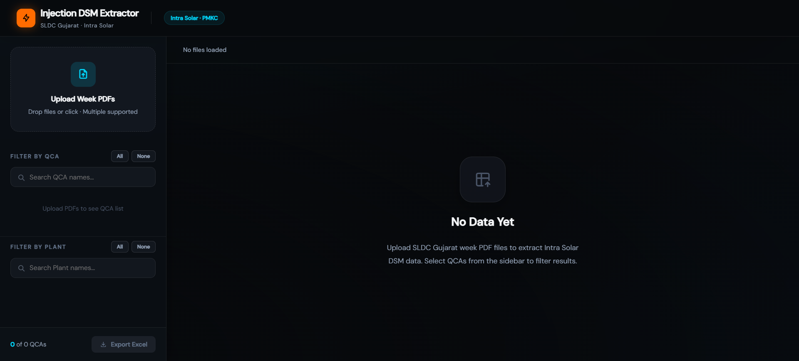

# Injection DSM Extractor

Full-stack web application for extracting SLDC Gujarat Intra Solar DSM data from week PDF files.



## Premium Features
- **Dynamic Horizontal Week Alignment**: Maintains a master list of all unique week numbers across multiple PDF uploads. If a plant has no data for a week, the system fills blank placeholders side-by-side perfectly, ensuring horizontal alignment across all entities in the exported Excel spreadsheet.
- **Smart Sheet Name Deduplication**: Solves Excel/SheetJS tab duplication errors. Dynamically detects identical QCA names, truncates safely under the 31-character Excel limit, and appends a safe counter suffix (e.g., `_1 DSM`, `_2 DSM`) to ensure a crash-free export.
- **Real-Time Progress & live ETA Engine**: Provides a visual progress bar and a highly accurate Estimated Time of Arrival (ETA) calculation as the backend processes heavy PDF extractions in parallel.
- **Center-Centered Table Layout**: Extracted table values are aligned strictly center-middle (both horizontally and vertically) matching business intelligence standards.

## Stack
- **Backend** — Node.js + Express + Python (pdfplumber for PDF parsing)
- **Frontend** — React 18 (no UI framework, pure CSS-in-JS)
- **Export** — `xlsx-js-style` (Excel with fully styled borders, zebra-stripes, and merged color headers)

## Prerequisites
```
Node.js >= 16
Python 3.8+
pip install pdfplumber
```

## Setup & Run

### 1. Install dependencies
```bash
# Root (server deps)
npm install

# Client (React deps)
cd client && npm install && cd ..
```

### 2. Install Python dependency
```bash
pip install pdfplumber
```

### 3. Development (runs both server + client)
```bash
npm run dev
```
- React dev server → http://localhost:3000
- API server       → http://localhost:4000

### 4. Production build
```bash
npm run build   # builds React into client/build/
npm start       # serves everything from port 4000
```
Open http://localhost:4000

## Usage
1. Open the app in browser
2. Drop or select week PDF files (e.g. Week-01.pdf … Week-50.pdf)
3. Server parses each PDF using Python — extracts all Intra Solar entities
4. Filter by QCA using the sidebar checkboxes
5. Click **Export Excel** → downloads `.xlsx` with all selected plant data
   - One sheet per QCA (sanitized and unique name)
   - One table per plant, separated by a blank column
   - Alternating row zebra striping, green headers for plant names, and blue headers for columns
   - Yellow highlighted total rows

## Project Structure
```
dsm-app/
├── server/
│   ├── index.js          ← Express API server
│   └── dsm_parser.py     ← Python PDF parser
├── client/
│   ├── public/index.html
│   └── src/
│       ├── index.js
│       └── App.js        ← Full React UI
├── package.json
└── README.md
```

## API Endpoints
| Method | Path | Description |
|--------|------|-------------|
| POST | /api/upload | Upload PDF files, returns extracted JSON |
| POST | /api/progress/:jobId | Get progress and ETA updates for active upload job |
| POST | /api/export | Send grouped data, returns styled .xlsx file |
| GET  | /api/health | Health check |
